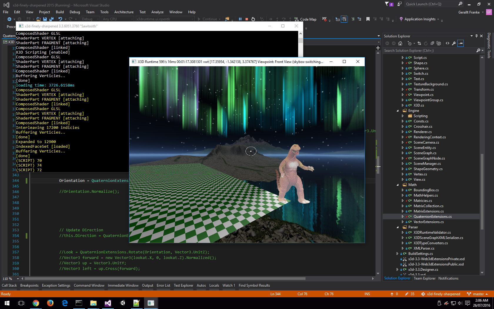
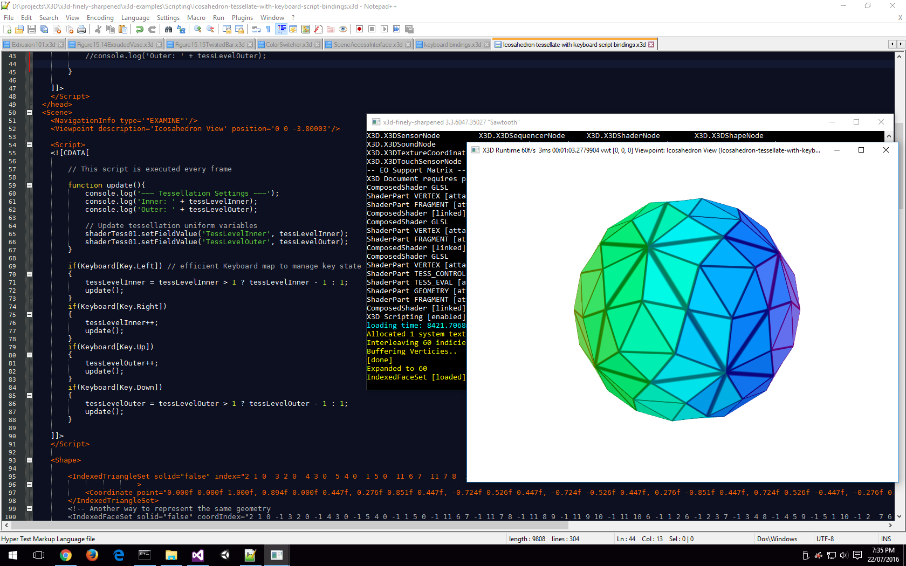

 
# x3d-finely-sharpened
X3D browser/engine written in C#

Featuring the latest bleeding edge developmental work on the X3D C# language binding. 


Intro
```

With software like Blender as well as libraries like OpenTK, X3D as a markup for 3D scenes makes for a viable alternative to the COLLADA XML dialect and other 3D formats.

"X3D is used for building 3-dimensional models, both simple and sophisticated, X3D can show animated objects from different viewpoint perspectives, allowing user insight and interaction. X3D models can be further combined and connected to build sophisticated 3D virtual environments running across the Internet." (Brutzman and Daly, 2007)

A copy of the OpenTK library ships along as the engine uses it at the moment as a point of reference to OpenGL. Currently we're a bit low on documentation but I have included a few X3D examples pulled from random sources on the www.
```

This engine has had a massive overhaul, now we support shader and script programming - we are working on implementing both the Interchange and Interactive profiles... Some important components such as the Route Graph and Prototyping are absent, right now there are a small number of issues on the backlog currently being investigated so stay tuned!





Example 1 - test of tessellated Icosahedron IndexedTriangleSet textured geometry
Written in pure X3D using GLSL shader scripts, as well as ECMAScript for user interactivity.



Example 2 - test of IndexedFaceSet: X3D Runtime 3.3 Core using OpenGL Version 4 


Example 3 - test of ElevationGrid: X3D Runtime 3.3 Core using OpenGL Version 4


Example 4 - test of tessellated ElevationGrid: X3D Runtime 3.3 Core using OpenGL Version 4


Example 5 - test Viewpoint and Background implementation: X3D Runtime 3.3 Core using OpenGL Version 4


Example 5 - #2


Example 5 - #3


Notices
```

This is currently no full X3D framework .. Imao there is no X3D browser that currently supports the entire v3.3 spec 
However, this C# codebase is focusing on implementing the rendering component properly 
and nailing down X3D Core early so the project's foundations adhere to the spec more thoroughly longterm.

This project is the current source there is an earlier prototype of the project 
archived on Google Code from 3 years ago which was written using the classic OpenGL v2.0 API. 
All that was done in the original prototype has been replaced with a lighter more customisable OpenGL 4.0 compatible engine and GLSL shader code. 
This is why the project here on github serves as the current most up to date version, 
and will likely be better than other X3D browsers available today noted that I take my hat off to X3DOM.
There's experimental code released of which I try and keep as stable as I can for each commit. 
The latest source code may be checked out using " git clone https://github.com/RealityDaemon/x3d-finely-sharpened "
Use Visual Studio 2015 for development and compilation.

```

Task list
```

COMPLETED: URL/URI/filesys/CDATA/data:text/plain assett & resource fetching (partial URN support)
COMPLETED: X3D XML Scene Export (b3ec3a7)
MOSTLY: Viewpoint and ViewpointGroup implementation and decent-scalable Camera model. (Support for Fly, and Examine)
PARTLY: Background, MultiTexturing, CubeMapping, ..
PARTLY: X3D Validation and invalid node pruning (Applied on the fly in the Runtime)
MOSTLY: Scripting using JavaScript (JIT compiled using the V8 Engine)
TODO: Node Prototyping
MOSTLY: abstract types defined according to X3D 3.3 spec, see x3d-3.3.Designer.cs
PARTLY: DEF and USE
PARTLY: grouping
TODO: event propagation between X3D nodes and their fields, and any shader uniforms
TODO: networking: inline, import, export, etc
PARTLY: scene graph and event graph models
PARTLY: transformations, and better conformance with standard
PARTLY: all texturing related nodes esp. TextureProperties, and refactor ImageTexturing
TODO: animations & interpolators and VW timing
TODO: lighting; phong shading, lit and unlit models, X3D Materials
TODO: Navigation component; LOD, Billboard, Collision, ..
TODO: Binary space partition, quadtree, or octtree optimisations
TODO: Raycasting engine component
PARTLY: geometry nodes
PARTLY: shaders
TODO: Simple volume rendering using slices fetched from sets of image files e.g. *.png, *.jpg
TODO: volume rendering using either: vox or nrrd formats or whatever will be defined by ISO
TODO: Write support for X3D-B Binary parsing, fast reading and writing. Input conversion between XML and Binary formats
PARTLY: SceneGraph rendering; DEF_USE, event graph, prototypes, routing fields and shader uniforms
TODO: documentation
TODO: complete range of X3D examples covering all node usages and test cases
```

Mission statement
```

A library implementing the X3D 3.3 specification, frugal by design, with no platform specific boundaries, 
and an X3D Scene that can be accessed/modified by whatever scripting language is present in the platform.
```

Info

[X3D on Wikipedia][1]

[X3D Edutechwiki][2]

[Web3D X3D Homepage][3]

[Web3D X3D V3.3 Specification Part1/Concepts][4]

[Web3D X3D V3.3 Specification Part1/Core][5]

[Web3D X3D V3.3 Specification Part1/Component Index][6]

[Mixed Augmented Reality X3D V4.1 Web3D MAR Application goals][7]

Licence

```

New BSD Licence

Copyright © 2013 - 2016, Mr Gerallt G. Franke of Melbourne/Tasmania, Australia

All rights reserved.

Redistribution and use in source and binary forms, with or without

modification, are permitted provided that the following conditions are met:

* Redistributions of source code must retain the above copyright notice, this list of conditions and the following disclaimer.

* Redistributions in binary form must reproduce the above copyright notice, this list of conditions and the following disclaimer in the documentation and/or other materials provided with the distribution.

* Neither the name of the library nor the names of its contributors may be used to endorse or promote products derived from this software without specific prior written permission.

THIS SOFTWARE IS PROVIDED BY THE COPYRIGHT HOLDERS AND CONTRIBUTORS "AS IS" AND

ANY EXPRESS OR IMPLIED WARRANTIES, INCLUDING, BUT NOT LIMITED TO, THE IMPLIED

WARRANTIES OF MERCHANTABILITY AND FITNESS FOR A PARTICULAR PURPOSE ARE

DISCLAIMED. IN NO EVENT SHALL MR GERALLT G. FRANKE BE LIABLE FOR ANY

DIRECT, INDIRECT, INCIDENTAL, SPECIAL, EXEMPLARY, OR CONSEQUENTIAL DAMAGES

(INCLUDING, BUT NOT LIMITED TO, PROCUREMENT OF SUBSTITUTE GOODS OR SERVICES;

LOSS OF USE, DATA, OR PROFITS; OR BUSINESS INTERRUPTION) HOWEVER CAUSED AND

ON ANY THEORY OF LIABILITY, WHETHER IN CONTRACT, STRICT LIABILITY, OR TORT

(INCLUDING NEGLIGENCE OR OTHERWISE) ARISING IN ANY WAY OUT OF THE USE OF THIS

SOFTWARE, EVEN IF ADVISED OF THE POSSIBILITY OF SUCH DAMAGE.

```

[1]: http://en.wikipedia.org/wiki/X3D
[2]: http://edutechwiki.unige.ch/en/X3D
[3]: http://www.web3d.org/x3d/
[4]: http://www.web3d.org/files/specifications/19775-1/V3.3/Part01/concepts.html
[5]: http://www.web3d.org/files/specifications/19775-1/V3.3/Part01/components/core.html
[6]: http://www.web3d.org/files/specifications/19775-1/V3.3/Part01/componentIndex.html
[7]: http://www.web3d.org/working-groups/mixed-augmented-reality-mar
